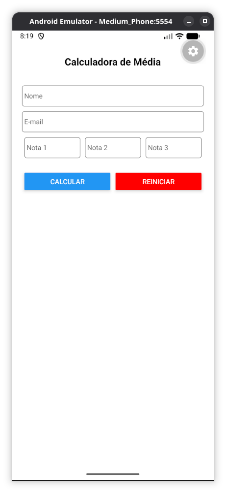
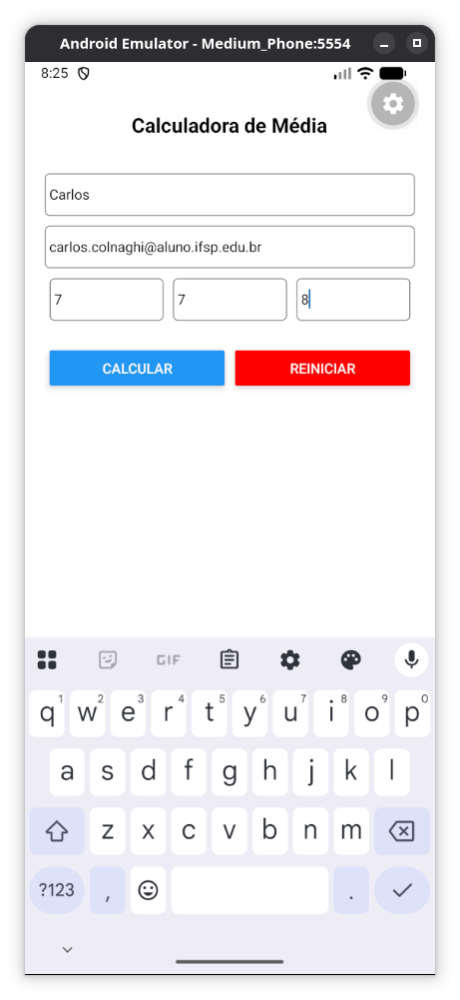
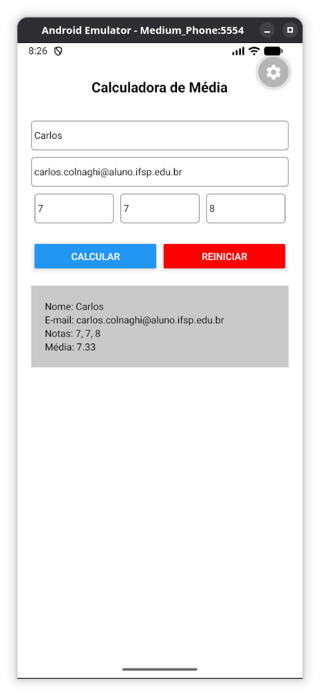

# Calculadora de Média

## Introdução

Este é um aplicativo desenvolvido com Expo e React Native como parte dos estudos da disciplina Desenvolvimento Multiplataforma 2 do curso de Especialização em Desenvolvimento de Sistemas para Dispositivos Móveis do IFSP - Câmpus São Carlos.

O objetivo deste projeto é desenvolver uma interface de usuário (UI), explorando componentes do React Native, como `View`, `Text`, `TextInput` e `Button`. Além disso, o projeto trabalha diretamente com o Hook `useState`, utilizando o gerenciamento de estado para criar uma aplicação dinâmica, capaz de atualizar os dados exibidos na tela conforme a interação do usuário.

## Sobre o aplicativo

A aplicação permite informar nome, e-mail e três notas. Ao acionar o botão de cálculo, o aplicativo processa os valores informados e exibe o resultado da média diretamente na interface.

Também há a opção de limpar os campos preenchidos e reiniciar os dados apresentados, reforçando o uso de estado para controlar as mudanças visuais e comportamentais da tela.

## Tecnologias utilizadas

- Expo
- React Native
- JavaScript

## Como executar

Instale as dependências do projeto:

```bash
npm install
```

Inicie o aplicativo com Expo:

```bash
npm start
```

Para executar diretamente no Android:

```bash
npm run android
```

Depois, utilize o Expo Go ou um emulador Android/iOS para visualizar a aplicação.

## Screenshots

<p>
  
  
  
</p>
